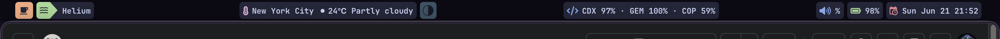
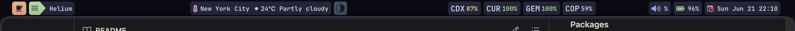

# sketchybar-codexbar-theme

A compact SketchyBar theme with a built-in CodexBar usage item, tuned for a clean top bar layout and day-to-day development use.

This theme was originally based on an existing SketchyBar theme and then modified to fit my own workflow and preferences.

## Preview

### Theme 1: Compact provider view



The compact view keeps CodexBar usage in a single item. It is the least visually busy option and works well when you want the bar to stay minimal.

```text
CDX 97% · GEM 100% · COP 59%
```

### Theme 2: Color-coded provider view



The color-coded view renders each provider as its own small item. Provider names stay in the default text color while the percentage changes color based on how close that provider is to its reset time. This keeps the theme readable while still making reset timing visible at a glance.

```text
CDX 87%   CUR 100%   GEM 100%   COP 59%
```

Clicking any CodexBar provider toggles between the compact view and the color-coded provider view. The CodexBar section refreshes every 5 minutes and only shows providers that currently return usable data. Providers that are disabled or unavailable are hidden automatically.

## Features

- Compact laptop and desktop variants
- Front app indicator
- Current space item
- Clock
- Weather
- Volume
- Battery on laptop
- CodexBar usage item with automatic provider filtering

## CodexBar section

The CodexBar section is managed by a hidden scheduler item. Each provider is rendered as its own small item, which keeps the provider code neutral while allowing the percentage color to change independently.

It reads:

```sh
codexbar usage --format json
```

It then:

- shows only providers with valid usage data
- ignores provider error entries
- tolerates partial provider failures
- removes providers that disappear from CodexBar output
- hides itself when no usable providers are returned
- toggles between split color-coded mode and compact mode on click

Split provider format:

```text
CDX 97%   GEM 100%   COP 59%
```

Compact format:

```text
CDX 97% · GEM 100% · COP 59%
```

Values represent remaining quota for each provider. Provider codes stay in the default text color. The percentage is color-coded by time until that provider's primary reset.

| Percent color | Meaning |
| --- | --- |
| Default text | Reset time is unknown |
| Green | More than half of the reset window remains |
| Yellow | Less than half of the reset window remains |
| Red | Reset is under 1 hour away |
| Intense red | Reset is under 30 minutes away |

Known providers use short labels such as `CDX`, `CUR`, `GEM`, `COP`, `CLD`, and `OAI`. Any other provider returned by CodexBar is supported automatically by using the first three characters of the provider name.

## Requirements

- macOS
- `sketchybar`
- `jq`
- `yabai`
- `codexbar` for the usage item
- a Nerd Font for the icons

## Installation

Clone the repo into your SketchyBar config location:

```sh
git clone git@github.com:1mpossible-code/sketchybar-codexbar-theme.git ~/.config/sketchybar
```

Then reload SketchyBar:

```sh
sketchybar --reload
```

If your setup differs, copy the files into your existing SketchyBar config and merge the items you want.

## File layout

- `sketchybarrc` selects laptop or desktop mode
- `sketchybarrc-laptop` contains the laptop bar layout
- `sketchybarrc-desktop` contains the desktop bar layout
- `plugins/` contains shared plugins
- `plugins-laptop/` contains laptop-specific plugins

## Attribution

This project is a modified theme, not a from-scratch design. If you know the original source theme, replace this note with a direct credit link.
